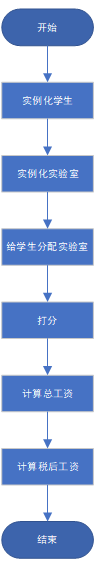
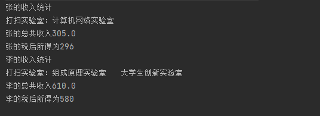

## 一、实验目的
1. 掌握java中类的定义
2. 掌握static、final等修饰符的用法
3. 了解异常的使用方法，并在程序中根据输入情况做异常处理

## 二、业务要求
&emsp;&emsp;某学校为了给学生提供勤工俭学机会，选派了部分学生参与实验室的卫生清洁工作。
每个学生被分配若干间实验室，视实验室的清洁打分情况给予劳务补贴。
&emsp;&emsp;按国家税务制度，劳务费应按国家规定纳税，请统计一学期学生的实际收入。

## 三、实验要求
1. 设计系统中的类（如：学生、实验室等等）
2. 一学期按18周计算；
3. 每个学生负责的实验室数量不一定相同；
4. 对学期勤工俭学收入和纳税进行统计，求得实际收入；
5. 国家最新纳税标准（系数），属于某一时期的固定值，与实例化对象没有关系，考虑如何用static、final修饰定义。
6. 根据处理情况，要在程序中考虑做异常处理。

## 四、实验过程
1. 设计系统中需要的类，学生、实验室,设置构造函数，并定义他们的属性。
   <br>&emsp;&emsp;1)Student类的属性：姓名,学号,补助价格,实验室列表；
   <br>&emsp;&emsp;2)Lab类的属性：不同等级补助价格，实验室名称，房间号，实验室评分表数组。
2. 实例化一些学生和实验室。编写函数add_lab，将实验室分配给不同的同学。
3. 设置评分机制，此处为了方便测试，我做了一种是直接传给他一个成绩列表。
4. 设置函数（cal_money）计算每个学生的所得总值，通过遍历学生的实验室列表，将实验室每周的分数都分别按照分数等级计算每周能获得的工资，并且求和。
5. 单独创建一个类Sl用来存储一些永恒不变的量，在本实验中即是国家规定不变的利率。
6. 设置函数（cal_tax），根据既定的不变利率，计算税后所得。（税率并非准确数字，为自定义税率）

## 五、流程图

## 六、主要代码
1. 实例化Lab类，在其中添加属于整个类的属性，价格补助。
``` java
public class Lab {
    static double great = 20; //优的补助价格
    static double good = Math.ceil(great * 0.75); //良的补助价格
    static double pass = Math.ceil(great * 0.5); //及格的补助价格
}
```

2. 并在Lab类中设置两种构造函数，使用默认补助价格。
``` java
    public Lab(String name,int room){  //使用默认的补助价格
        this.name = name;
        this.room = room;
    }

```

3. cal_money函数，通过遍历学生的实验室列表，将实验室每周的分数都分别按照分数等级计算每周能获得的工资，并且求和。
``` java
    public void cal_money(){
        int[] a = new int[18];
        System.out.println(this.name + "的收入统计");
        for (int i = 0;i< labs.length;i++){

            if (labs[i] == null){
                continue;
            }
            else {
                System.out.println(labs[i].getName() + "收入统计：");
                a = labs[i].getScore(); //分数数组
                for(int j=0;j<18;j++){

                    if(a[j]>0 & a[j]<=5){ //5分一下及格
                        money = money + Lab.pass;
                        System.out.println(j+1 +"周收入:" +money);
                    }
                    else if(a[j]>7 & a[j]<=10){ //7分以上优秀
                        money = money + Lab.great;
                        System.out.println(j+1 +"周收入:" +money);
                    }
                    else if(a[j]>5 & a[j]<=7){  //其余良好
                        money = money + Lab.good;
                        System.out.println(j+1 +"周收入:" +money);
                    }
                }
            }
        }
        System.out.println(this.name + "的总共收入" + money);
    }
```

6. 创建类Sl，用来存储不能被修改的利率。
``` java
public class Sl {
    public static final double tax = 0.03;
    public static final double taxmax = 0.05;
    public static final double taxmin = 0.01;
}
```

7. shuihou函数，根据相应利率，计算税后所得。
``` java
    public void shuihou(){
        if(money<=200){
            System.out.println(this.name + "的税后所得为"+ Math.round(money*(1- Sl.taxmin)));
        }
        else if(money>200 & money<=400){
            System.out.println(this.name + "的税后所得为"+ Math.round(money*(1- Sl.tax)));
        }
        else if(money>400){
            System.out.println(this.name + "的税后所得为"+ Math.round(money*(1- Sl.taxmax)));
        }
    }
```

## 七、运行截图
1. 后台打分，默认补助价格，多个学生分配多个实验室。
   
   
## 八、感想体悟
&emsp;&emsp;本次实验相对于前两次实验简单，但是此次实验不够完善，没有达到预期效果，让学生进行选择要打扫的实验室，对实验室进行打分，最后得出每个实验室总的打分表，计算出相应的钱数。
